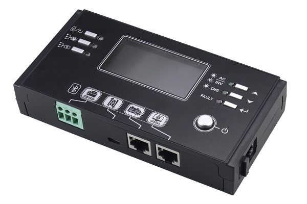
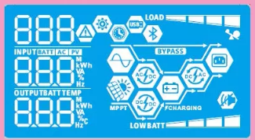

# Credits

Special thanks goes to the following for the basis of this modified code:

* https://github.com/SirUli/FroniusSmartmeter <br>
* https://github.com/bradcagle/dbus-btbattery <br>
* https://github.com/victronenergy/velib_python <br>

And all other authors and community members of victron which developed or helped to develop drivers, services and components
# Inverters
This is a driver for VenusOS devices.

The driver will communicate with PIP/Axpert/Infinisolar/Voltronic/PowLand/OutBack and other compatible solar inverters via Bluetooth <br/>
and publish this data to the VenusOS system.

!!! System needs to have a Bluetooth-supported panel in range!
see images



## Prerequisites
You need to setup some dependencies on your VenusOS first:

1) SSH to IP assigned to VenusOS device<br/>

2) Resize/Expand file system<br/>

```sh
/opt/victronenergy/swupdate-scripts/resize2fs.sh
```

3) Update opkg<br/>
```sh
opkg update
```

4) Install pip<br/>
```sh
opkg install python3-pip
```

5) Install build essentials as bluepy has some C code that needs to be compiled<br/>
```sh
opkg install packagegroup-core-buildessential
```

6) Install glib-dev required by bluepy<br/>
```sh
opkg install libglib-2.0-dev
```

7) Install bluepy<br/>
```sh
pip3 install bluepy
```

## Installation
When you install with one of these methods the system will take care of starting the service and keep it running. You might want to start things manually. In this case, do not use the SetupHelper method. Install manually but skip the install script. After that you can proceed with the configuration and testing manually section.

### Install with SetupHelper from kwindrem

This script is meant to be installed through the SetupHelper of kwindrem. 
https://github.com/kwindrem/SetupHelper

Use the following details:

Package Name: `OutbackSPC`<br>
GitHub User: `DonDavici` <br>
Github branch or tag: `main` <br>


### Install manually
1) Install git<br>
```sh
opkg install git
```

2) Switch to the victronenergy directory
```sh
cd /opt/victronenergy
```

3) Clone OutbackSPC repo<br/>
```sh
git clone https://github.com/DonDavici/OutbackSPC.git
```

4) run install script
```sh
run ./installservice.sh
```

5) Reboot your system
```sh
reboot
```
## Configuration
#### Due to the fact that we have to connect to the device to read the data (I don't think it has implemented notify functionality - maybe I am wrong ;-) we have to trust and pair our device manually before we can use it with our service.

1) select our service directory
```sh
cd /opt/victronenergy/OutbackSPC
```
or if you used SetupHelper
```sh
cd /data/OutbackSPC
```

2) Scan for nearby devices
```sh
./scan.py
```
After you have found out the mac address of your device you have to make the device connectable.<br/> 
replace xx:xx:xx:xx:xx:xx with the Bluetooth address of your Inverter<br/>

3) Start bluetoothctl<br>
```sh
bluetoothctl
```
4) Trust the device<br>
```sh
trust xx:xx:xx:xx:xx:xx
```
5) Pair with the device<br>
```sh
pair xx:xx:xx:xx:xx:xx
```
(enter 000000 or 123456)

6) Connect optionally to verify connection<br>
```sh
connect xx:xx:xx:xx:xx:xx
```
7) Exit bluetoothctl
```sh
exit
```
8) Edit default_config.ini (set OUTBACK_ADDRESS)
```sh
nano default_config.ini
```
8) Reboot system
```sh
reboot
```

## Test with output to console 
#### with config (OUTBACK_ADDRESS has to be set in default_config.ini)
```sh
/opt/victronenergy/OutbackSPC/dbus-btoutback.py
```
#### Test without config
```sh
/opt/victronenergy/OutbackSPC/dbus-btoutback.py xx:xx:xx:xx:xx:xx
```
### Logfiles
```sh
/var/log/OutbackSPC
```

# NOTES: 
## $\color{Red}\Huge{\textsf{This driver is still in development}}$
## $\color{Red}\Huge{\textsf{and may not work as intended.}}$
## $\color{Red}\Huge{\textsf{Use at your own risk!}}$
